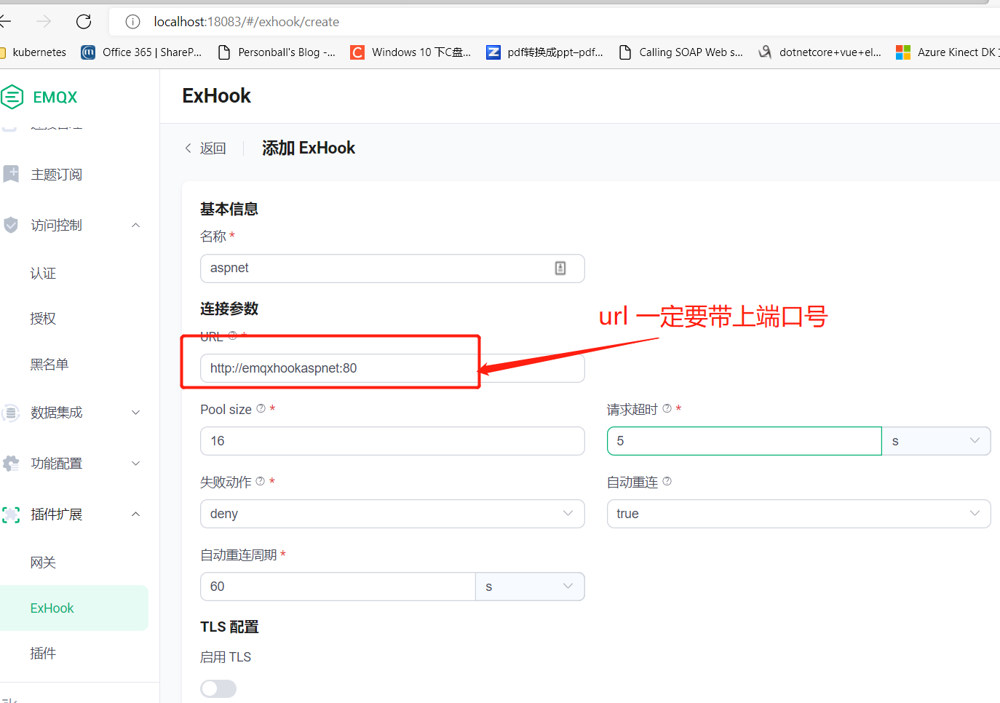
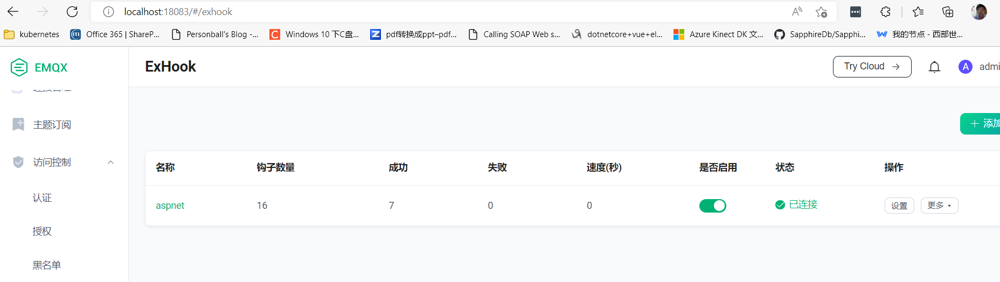
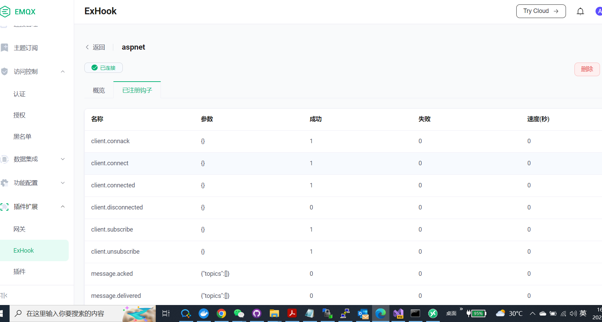

# emqx-exhook-aspnetcore
 
This is a EMQX Broker exhook demo server written in dotnet for exhook

[多语言的 钩子扩展](https://www.emqx.io/docs/zh/v5/advanced/lang-exhook.html)

## Prerequisites

- .NET 6 or higher

## Run 

```
dotnet run --project  .\EmqxHookASPNET\EmqxHookASPNET.csproj
```
or visual studio 2022 debug with docker-compose
- set Built-in Database auth 
username : mqttx_e163c7ba  password:1234567890

- set ExHook with aspnet


enable aspnet exhook


aspnet exhook list


## License
[MIT](./LICENSE)

